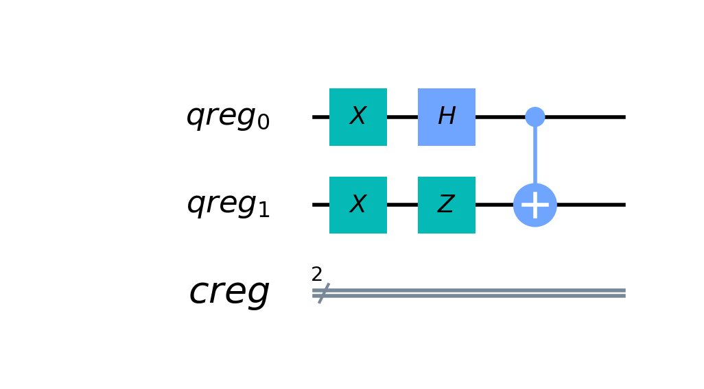
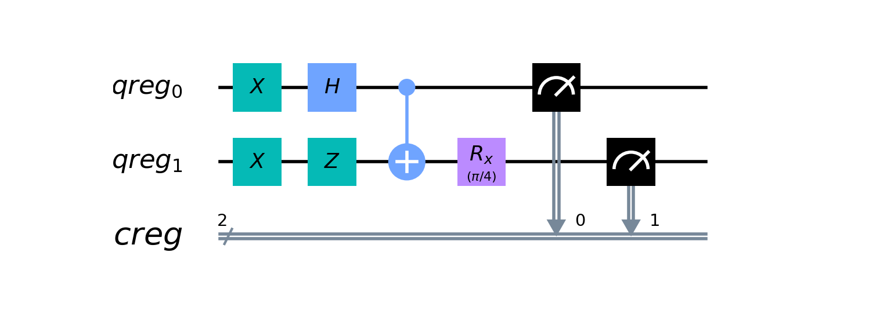
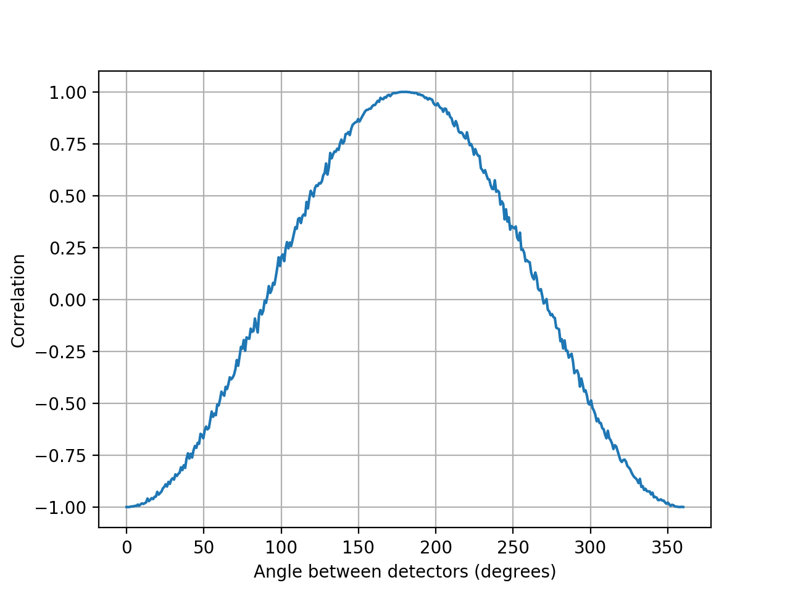

# Quantum Bell Test

Very quick and dirty Qiskit program that simulates a Bell experiment and draws a correlation plot.

## The circuit

To simulate an Einstein-Podolsky-Rosen-Bell experiment, we would need two qubits in a singlet entangled state. The designed circuit to achieve that is the following:



If we measured now, we would obtain either 01 or 10.

Adding an `Rx` gate before measurement of one of the qubits simulates the act of measuring along a different basis.



The goal of the experiment is to vary the angle between two measurements bases, run the above circuit multiple times and for each angle calculate the _correlation_ of the results.

## Results

Resulting correlation plot:



## Notes

The script runs the above circuit on a simulator backend:

```Python
    emulator = Aer.get_backend('qasm_simulator')
    job = execute(qc, emulator, memory=True, shots=2048)
    res = job.result()
```
Of course to really prove the correlation results to be the ones computed by quantum mechanics, we should run the circuit on a real quantum computer backend.
